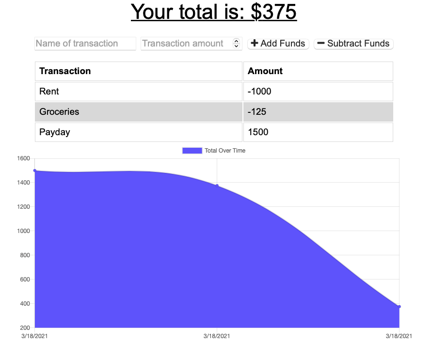

# BudgetTracker

Github: https://github.com/jmurphy0/budgetTracker.git
Heroku: https://murphybudget.herokuapp.com

# Table of Contents

- [Author](##Author)
- [Project Description](##Description)
- [Install](##Install)
- [Usage](##Usage)
- [Testing](##Testing)
- [License](##License)
- [Contributors](##Contributors)
- [Questions](##Questions)

## Author

Name: Jack Murphy
GitHub: jmurphy0

## Description

Keeps track of your money, regadless of your internet connection.

## Install

N/A

## Usage

Use in chrome from heroku

## Testing

N/A

## License

License:   
 License link: https://opensource.org/licenses/MIT

## Contributors

dont

## Questions

N/A
